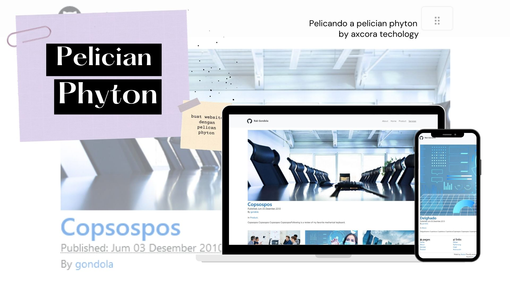
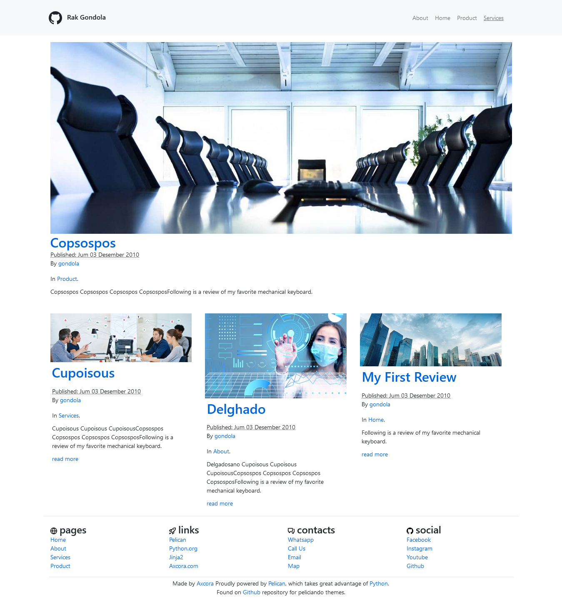
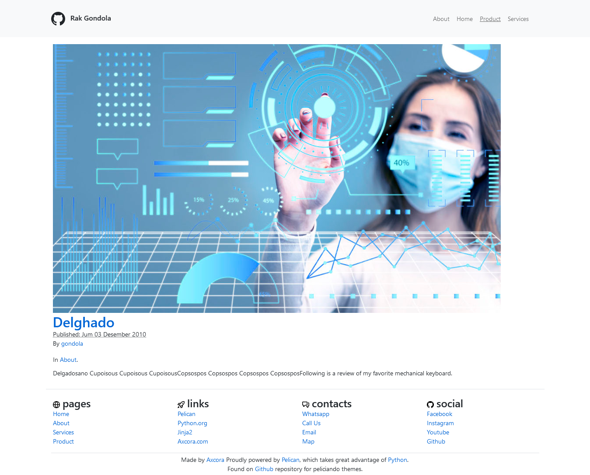
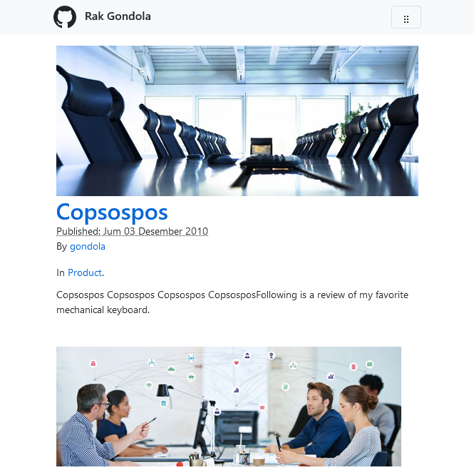

# Peliciando

A blast fast modern with SEO for phyton pelican template

Test drive demo [https://rakgondola.web.app/ →](https://rakgondola.web.app/)

Documentation [https://www.hockeycomputindo.com/2022/03/new-pelician-template-pecliando-phyton.html →](https://www.hockeycomputindo.com/2022/03/new-pelician-template-pecliando-phyton.html)

----------------------------------------

### [🚀 Become a Sponsor](https://github.com/sponsors/mesinkasir) | [☕ Buy me Coffee](https://www.paypal.com/cgi-bin/webscr?cmd=_s-xclick&hosted_button_id=JVZVXBC4N9DAN)

------------------------------------

Recipes :
+ Phyton
+ GetPelican
+ Bootstrap
+ Primer
+ Axcora

Features: 
+ Blog
+ Markdown
+ Auto SEO

--------------------------------------

### DISPLAY

Home page with article list

Other page with image

Mobile display

------------------------

Test drive demo [https://rakgondola.web.app/ →](https://rakgondola.web.app/)

Documentation [https://www.hockeycomputindo.com/2022/03/new-pelician-template-pecliando-phyton.html →](https://www.hockeycomputindo.com/2022/03/new-pelician-template-pecliando-phyton.html)

-------------------------------

WORK :
+ create venv on pelican project and activate `venv\Scripts\activate`
+ create new folder name it themes in to your pelican project or run `mkdir themes`
+ download and upload peliciando to themes folder or `cd themes && git clone https://github.com/mesinkasir/peliciando.git`
+ open `pelicanconf.py`
+ insert THEME = `themes/pelicianido` on pelicanconf.py
+ or open pelicanconf.py from peliciando and copy to project/pelicanconf.py

----------------------------------------

### [🚀 Become a Sponsor](https://github.com/sponsors/mesinkasir) | [☕ Buy me Coffee](https://www.paypal.com/cgi-bin/webscr?cmd=_s-xclick&hosted_button_id=JVZVXBC4N9DAN)

--------------------------------------------------------------------------------------------------------------------
